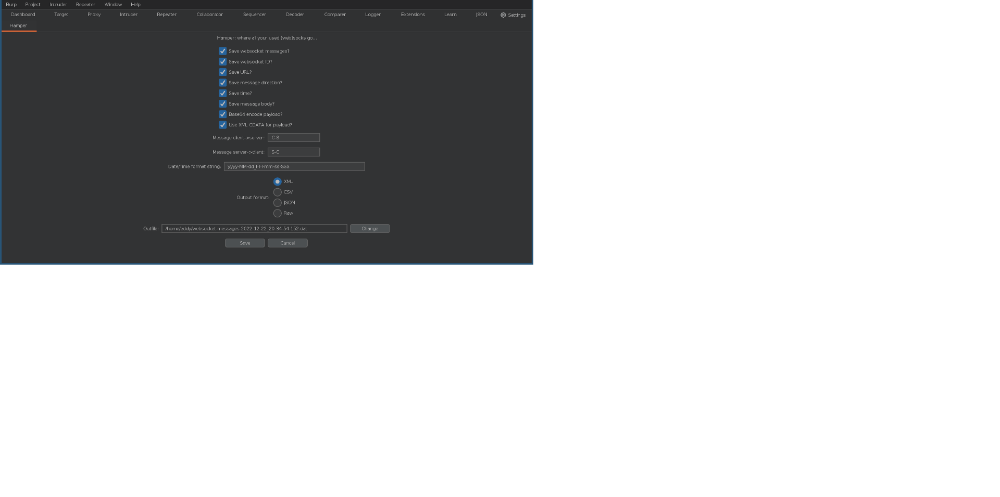

# Hamper extension for Burpsuite

## Notice

Moved to [Codeberg](https://codeberg.org/evilwan/hamper) because of policy changes at Github (see
[Github notice](https://github.blog/2023-03-09-raising-the-bar-for-software-security-github-2fa-begins-march-13) )

## Introduction

Hamper is a Burpsuite extension for recording websocket messages to the local filesystem. The new Burpsuite extension API, called "Montoya", offers the option of intercepting all websocket messages. This extension does exactly that: from the moment that the extension is installed, or when Burpsuite starts up if the extension is loaded at startup, the extension will intercept all incoming and outgoing websocket messages and will record them in a file.

At the moment there are 3 output file formats implemented:

  * XML
  * JSON
  * CSV

The new Montoya API requires a recent version of Burpsuite: version 2022.11 or newer.

Apparently the current version of Montoya has no option to save a selection of intercepted websocket messages from the proxy websocket messages tab (and no way to hook up an extension in the context menu when right clicking on one or more intercepted websocket messages)

## Installation
In Burp go to the "Extender" tab, then select the "Extensions" sub-tab and click "Add"

This is a Java extension, so select extension type "Java" and for extension file, select the Jar file that comes with
this extension (e.g. `Hamper-1.0.jar`) Accept all defaults for the extension and you are good to go.

## Usage

The extension is meant to be "always on". However, the extension will add a new configuration tab to the GUI. Look for the tab with name "Hamper".

The panel contains various switches to turn features on or off:

  * "Save websocket messages?": Hamper will save messages when this checkbox is selected. Uncheck this box to stop saving websocket messages
  * "Save websocket ID?": Hamper will give a sequence number as ID for every websocket that it intercepts. When active from the start of Burpsuite, this value could correspond to the ID shown in the Burpsuite list of intercepted websocket messages, but there is no guarantee that this is really so. Nevertheless, this ID field will allow to detect which messages were intercepted on the same socket. If this information is not wanted in the output, then uncheck this box.
  * "Save URL?": when selected, Hamper will save the URL used to establish the websocket.
  * "Save message direction?": when set, Hamper will include an indicator if a message was sent from client to server or from server to client.
  * "Save time?": when set, Hamper will write the time of interception of the message in the output file. Note that this time the moment when Hamper intercepts the message and this may be slightly different from the timestamps shown in the Burpsuite GUI.
  * "Save message body?": when set, Hamper will include the actual websocket message data in the output.
  * "Base64 encode payload?": when set, Hamper will base-64 enode the websocket payload **for binary messages**. Montoya makes a distinction between binary and string messages. This flag only applies to binary data, as reported by Montoya. That means that text messages (such as JSON) are not base-64 encoded, regardless of the setting of this checkbox
  * "Use XML CDATA for payload?": when set, Hamper will use CDATA markers around the message payload strings. This only applies to XML output files. If the websockets contain "special" XML characters, this option is useful for protecting the integrity of the output XML.
  * "Message client->server": the text in this textbox will be used to indicate that a websocket message was sent by the client to the server. You can specify any marker that you want in this field, but be aware of the selected output format: "C->S" might look good, but will trip up XML output.
  * "Message server->client": does the same but for messages sent by the server to the client
  * "Date/Time format string": this string will be used to format websocket message timestamps. Check the Java date/time formatting string specifications for details.
  * "Output format": select the desired output file format. Note that for now, the raw option is not yet implemented.
  * "Outfile": the name of the output file into which the intercepted websocket messages are written.
  * "Save": will accept your changes in this tab and activate your selected options
  * "Cancel": will undo your changes. Note, however, that if you selected a new output file, that file will still be created, but without any actual websocket data.

## Build from source code

The first step would be to download the source code from [here](https://github.com/evilwan/hamper) and extract the
archive in a convenient place.

If you have Maven installed, then go to the top level directory of the extracted archive and type:

`mvn package`

At the end, you will find the Jar file in subdirectory `target/`

If you do not have Maven at hand, the process is slightly more complicated. Your best bet would be to compile the java code in this extension against
a Burpsuite Jar file (that is: put the Burpsuite Jar in your classpath) After compilation, package the classfiles for this extension in a separate Jar file
(there is no need to include the Burpsuite Jar in the extension Jar)

From the subdirectory `src/main/java` of the extracted sources, compile the code by hand with something like this:

`javac -cp <your-burpsuite.jar> burp/*.java evilwan/*.java`

followed by a packaging like this:

`jar cvf your-hamper.jar burp/*.class evilwan/*.class`

## Future plans

The current version of Hamper works and saves all intercepted websocket messages. However, a configurable filtering system could be useful, so that the amount of save data can be kept to a manageable size.

Saving in multiple output files is currently not on the roadmap as the number of active (open) files could grow quickly and most operating systems do not respond well to large numbers of open files.

More enterprising versions might include configurable filters where messages will effectively be modified automatically, based on user definable filters.

## License

This extension is distributed under a 3 clause BSD license:

    Copyright (c) 2022 Eddy Vanlerberghe.  All rights reserved.
    
    Redistribution and use in source and binary forms, with or without
    modification, are permitted provided that the following conditions
    are met:
    1. Redistributions of source code must retain the above copyright
       notice, this list of conditions and the following disclaimer.
    2. Redistributions in binary form must reproduce the above copyright
       notice, this list of conditions and the following disclaimer in the
       documentation and/or other materials provided with the distribution.
    3. The name of Eddy Vanlerberghe shall not be used to endorse or promote
       products derived from this software without specific prior written
       permission.
    
    THIS SOFTWARE IS PROVIDED BY EDDY VANLERBERGHE ''AS IS'' AND
    ANY EXPRESS OR IMPLIED WARRANTIES, INCLUDING, BUT NOT LIMITED TO, THE
    IMPLIED WARRANTIES OF MERCHANTABILITY AND FITNESS FOR A PARTICULAR PURPOSE
    ARE DISCLAIMED.  IN NO EVENT SHALL EDDY VANLERBERGHE BE LIABLE
    FOR ANY DIRECT, INDIRECT, INCIDENTAL, SPECIAL, EXEMPLARY, OR CONSEQUENTIAL
    DAMAGES (INCLUDING, BUT NOT LIMITED TO, PROCUREMENT OF SUBSTITUTE GOODS
    OR SERVICES; LOSS OF USE, DATA, OR PROFITS; OR BUSINESS INTERRUPTION)
    HOWEVER CAUSED AND ON ANY THEORY OF LIABILITY, WHETHER IN CONTRACT, STRICT
    LIABILITY, OR TORT (INCLUDING NEGLIGENCE OR OTHERWISE) ARISING IN ANY WAY
    OUT OF THE USE OF THIS SOFTWARE, EVEN IF ADVISED OF THE POSSIBILITY OF
    SUCH DAMAGE.

